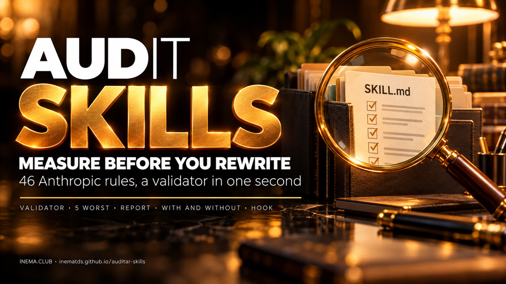

# Auditar Skills

**🇧🇷 [Português](README.md) · 🇺🇸 [English](README.en.md) · 🇪🇸 [Español](README.es.md)**

[](https://inematds.github.io/auditar-skills/guia/en/)

> Based on [robonuggets/skill-creator-plus](https://github.com/robonuggets/skill-creator-plus) (MIT, RoboNuggets). All credit for the validator, the 46 rules and the skill goes to RoboNuggets. INEMA added the recipe, two scripts and the PT/EN/ES guide.

## What it is

Auditar Skills is an open kit to check your agent's skills, the folders with a SKILL.md file that Claude Code and Codex use to do a task the same way every time. It ships skill-creator-plus, a RoboNuggets skill that checks each skill against 46 Anthropic rules, plus a five-step INEMA recipe: run the validator, take the five worst, generate a report, test with and without the skill and turn on a hook. It is for anyone who already has several skills and does not know which ones are broken. All it needs is Python 3.8 or newer, and no skill changes without your approval.

## 📖 User guide

Full guide (landing + step by step): **https://inematds.github.io/auditar-skills/guia/en/**

## Start with three commands

```bash
git clone https://github.com/inematds/auditar-skills ~/auditar-skills
cd ~/auditar-skills
python3 skill-creator-plus/scripts/validate_skill.py --all ~/.claude/skills    # Codex: ~/.agents/skills
```

You get a table with one line per skill: errors, warnings, notes and the IDs of the rules broken. The validator only reads; it changes nothing.

To get the five worst in a Markdown report:

```bash
python3 skill-creator-plus/scripts/validate_skill.py --all ~/.claude/skills --json \
  | python3 scripts/relatorio.py - --top 5 > relatorio.md
```

## The INEMA recipe

1. **Validator on all** the skills in the folder.
2. **The 5 worst** (or the 5 you use most) with `scripts/relatorio.py`.
3. **Report before editing:** install the skill and ask for AUDIT mode; nothing changes until you choose.
4. **Test with and without** the skill before deleting a "too prescriptive" line.
5. **Hook** that runs the validator every time a `SKILL.md` is saved (`scripts/hook_validar.py`, sample `settings.json`; not installed by default).

Full step by step, with the commands and the hook example: [docs/receita-inema.md](docs/receita-inema.md) (in Portuguese).
Real sample report, on copies of four INEMA skills: [examples/relatorio-inema.md](examples/relatorio-inema.md) (in Portuguese).

## Install the skill

The `skill-creator-plus/` folder is the original skill, with a single INEMA change to the validator (see below). Copy it to your skills folder:

```bash
cp -r ~/auditar-skills/skill-creator-plus ~/.claude/skills/    # Claude Code
cp -r ~/auditar-skills/skill-creator-plus ~/.agents/skills/    # Codex
```

Then, in a new session, ask in plain words. Three modes:

| Mode | Say something like | You get |
|---|---|---|
| AUDIT | "Audit my deploy skill against Anthropic's rules." | A report: one row per rule, fails first, ranked fixes. Nothing is edited until you pick. |
| NEW | "Make this a skill, we write release notes like this every Friday." | Test prompts first, then a new skill folder that passes the validator. |
| REFINE | "The report skill keeps forgetting the date filter. Fix the skill." | The rule rewritten around its reason, usually shorter than before. |

The skill passes its own validator: 0 errors, 1 warning (the original README image is not mentioned in SKILL.md).

## INEMA change to the validator

The original `validate_skill.py` only recognises English and raised false alarms on skills written in Portuguese or Spanish. The INEMA mirror changes three regular expressions, nothing else (marked `# Mudança INEMA` in the code):

| Rule | Original | In the INEMA mirror |
|---|---|---|
| DS3 (when to use) | only "Use when…", "whenever", "triggers on"… | also accepts "Use quando…", "quando usar", "sempre que", "Gatilhos", "acione quando", "Úsala cuando…", "cuando el usuario", "disparadores" |
| ST5 (contents list) | only the heading "Contents" / "Table of contents" | also accepts "Sumário", "Índice", "Conteúdo", "Contenido", "Tabla de contenido(s)" |
| CT9 (TODO) | any upper-case "TODO" | "TODO" only when followed by `:` or `(` (or at the end of a line); the Portuguese word "TODO" ("all") no longer counts. FIXME always counts |

Measured on the 123 skills in `~/.claude/skills` (2026-10-06): DS3 went from 75 to 38 warnings, CT9 from 10 to 2 errors, ST5 from 248 to 246. Minimal test: `python3 tests/test_validador_ptes.py` (13 cases, including the ones that must still fail).

## What is in the box

```text
skill-creator-plus/            the original RoboNuggets skill (MIT); only the validator changed
  SKILL.md                     rules, the three modes and links to the rest
  references/                  checklist of the 46 rules, authoring guide, testing
  scripts/validate_skill.py    the validator (Python 3.8+, standard library only)
  scripts/init_skill.py        scaffolds a new skill that already passes the validator
  examples/                    broken sample skill, validator output and report
  README.md                    the original README
scripts/relatorio.py           INEMA: Markdown report of the N worst from --json
scripts/hook_validar.py        INEMA: PostToolUse hook that validates when a SKILL.md is saved
docs/receita-inema.md          INEMA: the five-step recipe (in Portuguese)
examples/relatorio-inema.md    INEMA: real report on four skills (in Portuguese)
tests/test_validador_ptes.py   INEMA: test of the PT/ES validator changes
guia/                          guide in PT, EN and ES (GitHub Pages)
```

The 46 rules, each with its source in Anthropic's documentation, are in the [original README](skill-creator-plus/README.md#the-rules) and in [skill-creator-plus/references/audit-checklist.md](skill-creator-plus/references/audit-checklist.md).

## Credits and license

Based on [robonuggets/skill-creator-plus](https://github.com/robonuggets/skill-creator-plus) (MIT, RoboNuggets), made by [RoboNuggets](https://www.skool.com/robonuggets). The failure-mode names used in audits come from Matt Pocock's "writing-great-skills". Not affiliated with Anthropic. MIT license, see [LICENSE](LICENSE) (RoboNuggets' original text, kept). Recipe, the `relatorio.py` and `hook_validar.py` scripts and the PT/EN/ES guide: [INEMA.CLUB](https://inema.club).
